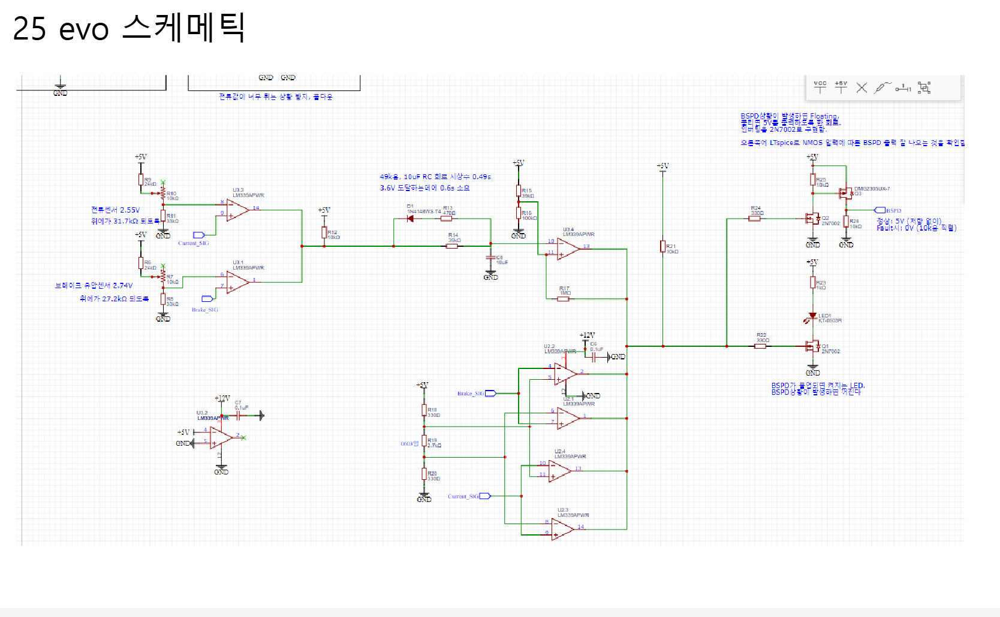
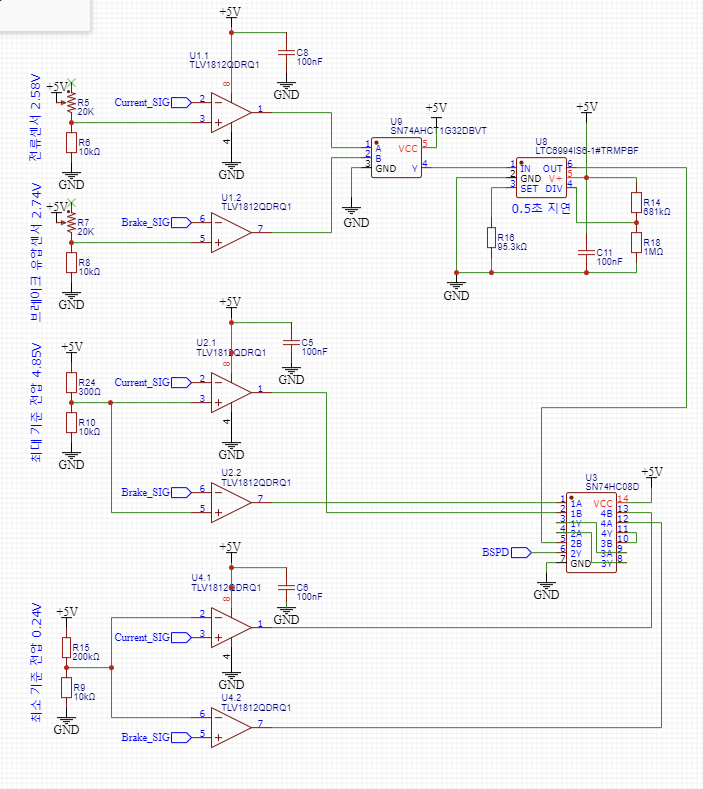
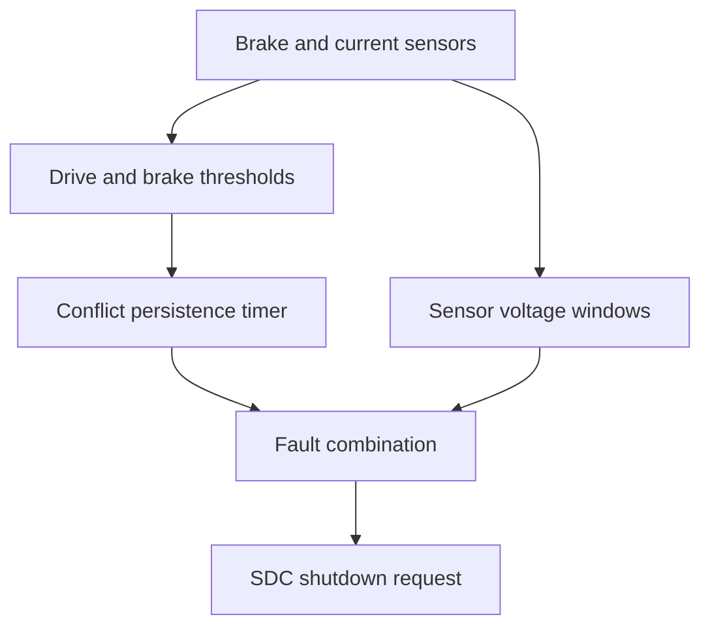

# Formula Student Electronics Study 🏎️⚡

A technical study repository documenting my learning from **Formula Student vehicle electronics and safety circuits**, with a focus on the **Brake System Plausibility Device (BSPD)**.

This repository turns team study work into a structured engineering record:

**Requirement → Circuit → Signal Flow → Timing → Failure Mode → Verification → Design Comparison**

---

## 바로 읽기

라이트온 팀 회로 스터디에서 공부한 BSPD를 **요구사항 → 신호 흐름 → 회로 동작 → 차량별 비교 → 계산·시뮬레이션 → 개선 검토** 순서로 정리했다. 실제 설계·제작·실측을 직접 수행했다는 의미는 아니며, 그 단계는 문서에서 별도로 표시한다.

| 읽을 자료 | 담긴 내용 |
|---|---|
| [한국어 전체 가이드](./docs/learning-guide-ko.md) | 처음 읽는 순서, 공부하면서 수정한 이해 |
| [25EVO 회로 해설](./schematic-walkthroughs/25evo.md) | Wired-AND, RC 충전·방전, 센서 이상 감지, MOSFET 출력 |
| [26 회로 해설](./schematic-walkthroughs/lef26.md) | Push-pull, OR/AND, LTC6994, 10초 복귀 신호 |
| [25EVO·26 비교](./comparisons/25evo-vs-lef26.md) | 회로 변경, 효과, 장단점, BSPD와 SDC의 역할 경계 |
| [Falstad 다이오드 비교](./simulations/falstad/README.md) | 짧은 반복 입력과 긴 입력 시험 파일 및 실행법 |
| [개선안 검토](./system-analysis/improvement-review-ko.md) | 타이머, 윈도우 비교기, 히스테리시스, 전원·센서 진단 |

### 25EVO — 비교기·RC·출력단

두 임계값을 모두 넘을 때 RC가 충전되고, 별도 센서 범위 검사와 함께 Fault를 판단한다. [그림을 따라 읽기](./schematic-walkthroughs/25evo.md).

### LEF-26 — 비교기·논리 게이트·전용 타이머

OR 게이트의 LOW가 동시 위험 조건을 나타낸다. 0.5초 지연 경로와 센서 범위 검사 경로는 병렬로 최종 AND에 들어간다. [그림을 따라 읽기](./schematic-walkthroughs/lef26.md).

---

## 한국어 학습 가이드

[처음 읽는 순서와 공부 요약](./docs/learning-guide-ko.md) · [규정과 판정 경로](./safety-circuits/bspd-requirements-ko.md) · [개선 검토](./system-analysis/improvement-review-ko.md) · [실측 기록 양식](./verification/measurement-template-ko.md)

Completed: concrete 25EVO/26 schematic walkthroughs, circuit images, basic notes, RC numerical study and a Falstad diode comparison. Pending: real-hardware measurements and implementation of proposed changes.

---

## Scope

The main case study is the evolution of the BSPD implementation between **25EVO** and **LEF-26**.

Topics include:

- Comparator threshold circuits
- Open-collector vs. push-pull outputs
- Pull-up / pull-down networks
- Wired logic
- RC timing and fast-discharge paths
- Dedicated timer ICs
- Sensor open/short detection
- Latch and reset behavior
- Shutdown-circuit interfaces
- Fail-safe design
- Design evolution and verification

---

## Repository Map

| Section | Purpose |
|---|---|
| [System Overview](./docs/system-overview.md) | BSPD from a vehicle-system perspective |
| [Fundamentals](./fundamentals/) | Reusable electronics concepts learned during the study |
| [Safety Circuits](./safety-circuits/) | Fault detection, fail-safe logic, latch/reset, shutdown behavior |
| [25EVO vs LEF-26](./comparisons/25evo-vs-lef26.md) | Design evolution and architecture comparison |
| [Schematics](./assets/schematics/) | Team circuit images reproduced with permission |
| [Schematic Walkthroughs](./schematic-walkthroughs/) | Signal-by-signal reading of 25EVO and LEF-26 |
| [Simulations](./simulations/) | Small numerical checks and circuit-behavior studies |
| [Verification](./verification/) | Fault-oriented test matrix and future measurements |
| [Sources & Notes](./docs/sources-and-notes.md) | Evidence boundaries and interpretation notes |

---

## BSPD at a Glance

A BSPD is a safety circuit that checks whether braking, propulsion, and sensor signals remain physically plausible.

In this study, the system is treated as a sequence of engineering decisions:

A separate path checks whether sensor voltages leave the expected range so that an invalid sensor signal cannot simply be interpreted as a safe condition.

---

## Design Evolution Studied Here

| Architecture | 25EVO | LEF-26 |
|---|---|---|
| Condition combination | Open-collector wired logic | Push-pull comparators and OR gate |
| Persistence check | RC charge and threshold comparator | Dedicated LTC6994-1 delay IC |
| Fault combination | Shared open-collector outputs | AND gate |
| SDC interface | MOSFET output stage | Logic output and separate recovery request |

The engineering value of the comparison is not that one architecture is universally “better”, but that it exposes the trade-offs among **timing accuracy, component tolerance, observability, reset behavior, interface clarity, and verification effort**.

### Example: 25EVO analog persistence timing

Rather than treating the schematic as an illustration, the walkthrough traces the charging path, comparator threshold, fast-discharge path, and the measurements needed to verify the explanation.

See: [25EVO Schematic Walkthrough](./schematic-walkthroughs/25evo.md)

---

## Selected Study Notes

### Fundamentals
- [Comparator Basics](./fundamentals/comparator-basics.md)
- [Open-Collector vs Push-Pull](./fundamentals/open-collector-vs-push-pull.md)
- [Pull-Up, Pull-Down, and Floating Nodes](./fundamentals/pull-up-pull-down.md)
- [RC Timing Circuits](./fundamentals/rc-timing.md)
- [Latch and Reset Logic](./fundamentals/latch-and-reset.md)

### Safety / System Analysis
- [BSPD System Analysis](./safety-circuits/bspd-system-analysis.md)
- [Sensor Fault Detection](./safety-circuits/sensor-fault-detection.md)
- [Fail-Safe Design Principles](./safety-circuits/fail-safe-design.md)

### Comparison
- [25EVO vs LEF-26](./comparisons/25evo-vs-lef26.md)

### Walkthrough & Verification
- [25EVO Schematic Walkthrough](./schematic-walkthroughs/25evo.md)
- [LEF-26 Schematic Walkthrough](./schematic-walkthroughs/lef26.md)
- [BSPD Verification Test Matrix](./verification/test-matrix.md)

---

## Verification Project

The first small verification project models the **25EVO RC timing stage** using an idealized RC model.

It checks:

- the difference between the RC time constant and actual threshold-crossing time,
- sensitivity to R/C tolerance,
- why a fast discharge path reduces repeated-pulse accumulation.

See: [RC Delay Simulation](./simulations/rc-delay/) and [Falstad diode comparison](./simulations/falstad/README.md).

---

## Documentation Rule

For every circuit or concept, I try to answer:

1. What requirement is being satisfied?
2. What signal enters the block?
3. What physical/electrical decision is made?
4. What is the output state?
5. What happens if a sensor or component fails?
6. How can the behavior be verified?
7. What assumptions or uncertainties remain?

---

## Disclosure / Permission

The schematic images in this repository originate from team project materials and are reproduced here **with permission from the team leader** for educational and portfolio documentation.

Their presence in this public repository does **not** imply an open-source license or permission for third-party reuse.

See [NOTICE.md](./NOTICE.md).

---

## Why This Repository Exists

My goal is not to archive slides.

It is to convert project participation into a reusable engineering knowledge base and to show how I move from:

**reading a circuit → understanding signal flow → questioning design choices → verifying behavior → documenting limitations.**
