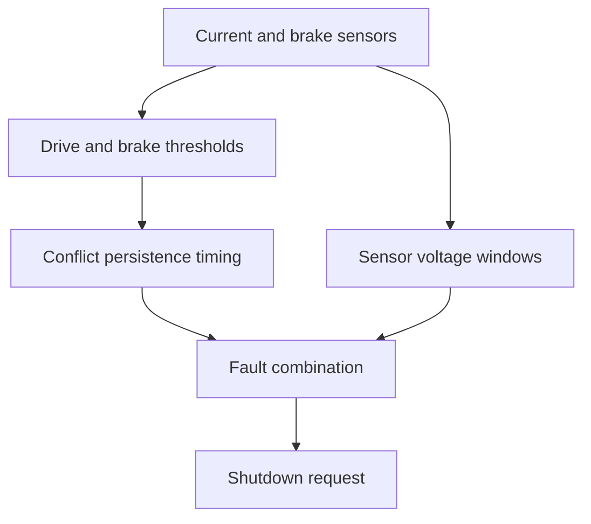

# BSPD System Overview

BSPD detects sustained strong-braking/propulsion conflicts and relevant system faults, then requests the shutdown circuit to open. SDC and AIR complete the vehicle isolation chain.

The validity branch bypasses the conflict persistence timer. It is not a prerequisite that sequentially enables the drive/brake test. A voltage-window test also cannot prove physical sensor health.

Fault activation persistence and continuous-safe-time recovery are different functions. Board boundaries do not define the whole safety function: trace BSPD output, recovery request, SDC state retention and AIR coil path together.

Start with the [Korean learning guide](./learning-guide-ko.md), [requirement summary](../safety-circuits/bspd-requirements-ko.md), [25EVO walkthrough](../schematic-walkthroughs/25evo.md), and [LEF-26 walkthrough](../schematic-walkthroughs/lef26.md).
