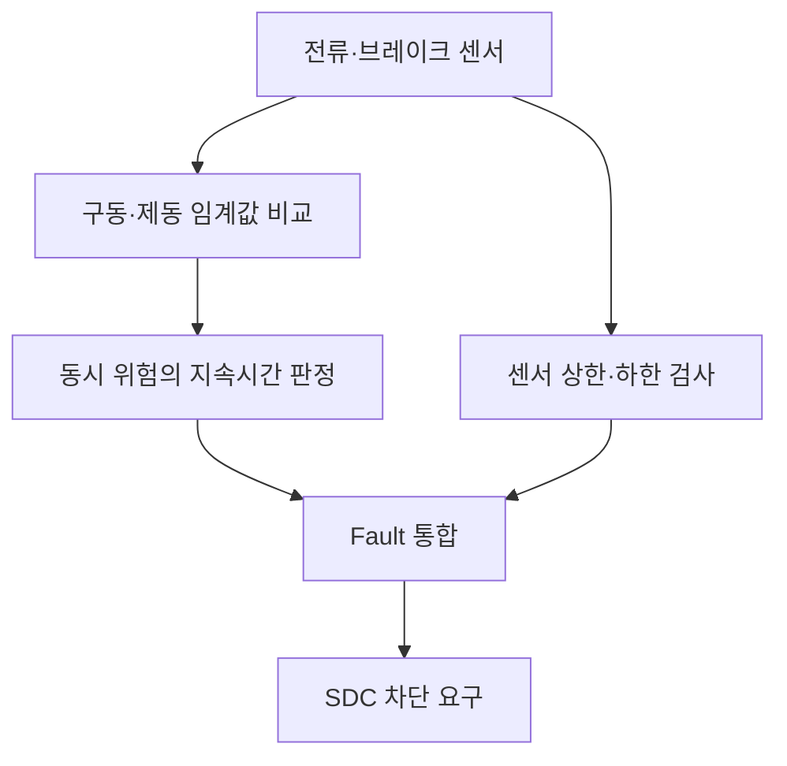

# BSPD 요구사항과 병렬 판정 경로

출처: 제공된 2026 Formula 차량기술규정 스터디용 PDF, 제60조 및 제56조. 스터디용 파일의 손글씨 주석은 규정 본문과 구분했다. 이 문서는 요약이며 검차 적합 판정은 아니다.

| 규정 | 핵심 요구 | 분석해야 할 회로 |
|---|---|---|
| 제60조 ① | 다른 기능을 하지 않는 독립형 PCB, 소프트웨어 제어 금지 | 하드웨어 판정 경로 |
| ①-1 | 공칭 배터리 전압 기준 5kW 초과에 해당하는 구동전류 기준 | 전류 센서 특성·기준전압 |
| ①-2 | 양의 구동전류와 강한 제동 상황이 0.5초 이상 지속되면 AIR 개방 | 동시 조건·지속시간 |
| ①-3·4 | BSPD 시스템 이상 감지, 두 센서 신호선 각각 분리 가능 | 범위 검사·전원·커넥터 시험 |
| ② | 해당 위험 상황이 연속 10초 이상 해제된 후 자동 재활성화 가능 | 연속 정상 시간·복귀 논리 |
| ④ | 압력센서 사용, 잠기는 휠이 없고 30bar 미만인 기준 | 실제 제동 특성 검증 |
| ⑤·⑥ | 차단 시 표시등 유지, RESET/허용된 자동 복귀 시 소등 | 차량 표시등 및 상태 유지 |
| ⑦ | 사용 센서는 축전지 박스 내부에 두지 않음 | 센서 위치 |

0.5초는 위험 조건 지속시간, 10초는 해제 후 자동 복귀 허용시간이다. 임계값 판정에 사용되는 0.24V는 규정이 직접 정한 수치가 아니다.

센서 범위 이상은 그림의 별도 가지로 Fault 통합에 전달된다. 정상 범위에 있다는 것만으로 구동·제동 동시 상황이 안전해지는 것도 아니고, 범위 이상에 반드시 0.5초를 기다리는 것도 아니다.

공칭 전압을 Vnom이라 할 때 전류 기준의 출발점은 I=5000/Vnom이다. 실제 센서 전압 기준은 센서의 오프셋·감도·분압 및 차량의 실제 공칭 전압으로 다시 계산한다. 다른 차량의 2.58V를 그대로 사용하지 않는다.
