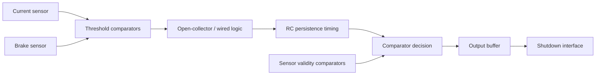

# 25EVO BSPD Walkthrough

## Architecture

---

## 1. Threshold decision

The current and brake signals are compared with reference levels.

The older implementation uses open-collector comparator outputs, so the external pull-up network is part of the logic behavior.

The important question is:

> Under which combination are the shared comparator outputs released, and under which combination is the node forced LOW?

---

## 2. RC persistence stage

The studied timing section uses an RC charging path followed by a comparator.

The key values visible in the studied version include approximately:

- `Rcharge = 10 kΩ + 39 kΩ`
- `C = 10 µF`
- a comparator threshold around `3.6 V`
- a diode + `470 Ω` fast-discharge branch

### Why this matters

`RC ≈ 0.49 s` is only the time constant.

The threshold crossing is later because the capacitor must charge to the comparator's threshold.

See the numerical check in [RC Delay Simulation](../simulations/rc-delay/).

---

## 3. Fast discharge

When the qualifying condition disappears, the diode path provides a much lower-resistance discharge route than the normal charging path.

Engineering purpose:

- remove residual capacitor charge,
- reduce pulse-to-pulse accumulation,
- make the next timing event start closer to the intended initial condition.

---

## 4. Sensor-validity path

Additional comparator channels check whether sensor voltages remain inside their intended electrical range.

This path addresses a different problem from the brake/current plausibility delay:

> Can the system trust the sensor signal at all?

---

## 5. Final output stage

The studied output stage converts the shared comparator result into a defined logic/output voltage.

Important concepts:

- high-impedance comparator output does not necessarily mean the **signal line** is floating,
- a pull-up can define the line voltage,
- the MOSFET output stage separates low-current logic from the receiving interface.

The exact reason for the buffer should be verified against the receiving shutdown-circuit requirements rather than inferred from the schematic alone.

---

## 6. What I would measure

If the physical circuit were available, I would verify:

1. current threshold voltage
2. brake threshold voltage
3. capacitor charging curve
4. actual persistence time
5. discharge time after a short pulse
6. repeated-pulse behavior
7. sensor lower/upper fault boundaries
8. final output HIGH/LOW voltage
9. behavior during power cycling
