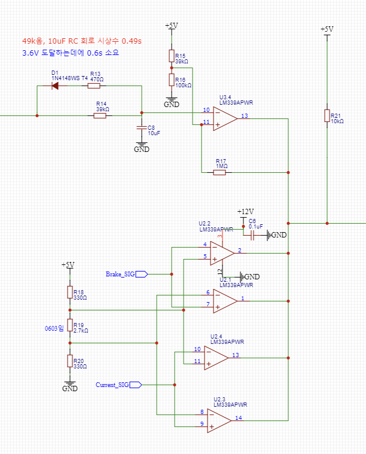
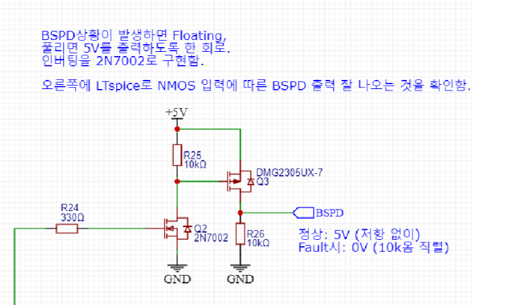

# 25EVO BSPD 회로 해설

노션의 25EVO BSPD 설명과 제공된 스케메틱을 함께 읽었다. 실제 제작품의 모든 리비전과 동일하다고 단정하지 않는다.

## 1. 두 센서 임계값과 Wired-AND

U3.3/U3.1의 LM339는 센서 신호를 (+), 기준을 (-)에 받는다. 기준 초과 시 출력 트랜지스터가 OFF되어 공통 노드를 놓아준다. 둘 다 초과해야 R12 풀업을 통해 RC 충전이 시작된다. 하나라도 미달이면 그 비교기가 공통 노드를 LOW로 당긴다.

| 전류 기준 초과 | 제동 기준 초과 | 공통 노드 | RC 상태 |
|---|---|---|---|
| 아니오 | 아니오 | LOW | 방전 |
| 예 | 아니오 | LOW | 방전 |
| 아니오 | 예 | LOW | 방전 |
| 예 | 예 | HIGH 방향 | 충전 |

그림의 기준값 표기는 전류 약 2.55V, 브레이크 약 2.74V이며, 다른 시험 기록에는 전류 2.58V도 나온다. 가변저항 설정과 도면 버전을 구분한다.

## 2. 지속시간 판정

충전 경로는 +5V → R12 10kΩ → R14 39kΩ → C8 10µF다. 따라서 이상적인 충전 시정수는 0.49초다. 고정 3.6V 기준을 가정하면 0V에서 판정까지 약 0.624초다. 실제 U3.4에는 R17 양의 되먹임이 있어 히스테리시스·출력 부하·비교기 포화전압에 따라 임계값과 시간이 달라진다.

조건 해제 시 앞단이 LOW가 되고 C8→R13 470Ω→D1→LOW 노드로 빠른 방전 경로가 열린다. 충전 중에는 D1이 역바이어스되므로 동시에 적극적인 방전이 일어나는 구조가 아니다. 다이오드가 즉시 완전 방전을 보장하지는 않는다.

## 3. 센서 전압 범위 검사와 최종 결합

아래 네 비교기는 전류·브레이크 신호가 약 0.49~4.51V 범위에 있는지 검사한다. U3.4 지연 판정과 함께 출력이 묶인다. 모두 정상이어야 공통 노드가 풀업으로 HIGH, 하나라도 이상이면 LOW다. 공통 노드만 측정하면 어느 비교기가 원인인지 알기 어려워 각 입력·기준도 함께 측정한다.

## 4. NMOS·PMOS 출력단

| 상태 | Q2 NMOS | Q3 PMOS | BSPD 출력 |
|---|---|---|---|
| 정상 | ON | 게이트가 낮아져 ON | 약 5V 공급 |
| Fault | OFF | R25가 게이트를 올려 OFF | R26 10kΩ으로 약 0V |

그림에 Fault 시 floating이라는 메모가 있어도, 이는 PMOS가 꺼져 5V 공급 경로가 개방된다는 의미로 구분해서 읽는다. R26이 있는 출력선 전체는 무부하에서 floating이 아니다. 수신부가 다른 전압을 인가하면 출력 전압·전류는 수신부와 함께 결정된다.

이 단계는 판정 결과를 SDC 입력에 전달할 출력 구동단이다. 구동 전류 확보나 수신부 조건 충족이 목적일 수 있으나, 정확한 선정 의도는 SDC 부하와 설계 기록으로 확인할 항목이다. 정상 표시 LED와 차량의 Fault 표시등도 구분한다.

## 5. 회로의 경계와 검증

10초 복귀와 차단 상태 유지 기능은 SDC 측을 포함해 추적한다. BSPD 도면에 없다는 이유로 차량에 없는 기능으로 판단하지 않는다.

[Falstad 반복 입력 비교](../simulations/falstad/README.md), [실측 체크리스트](../verification/test-matrix.md), [개선 검토](../system-analysis/improvement-review-ko.md)를 연결해서 읽는다.
