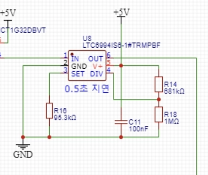
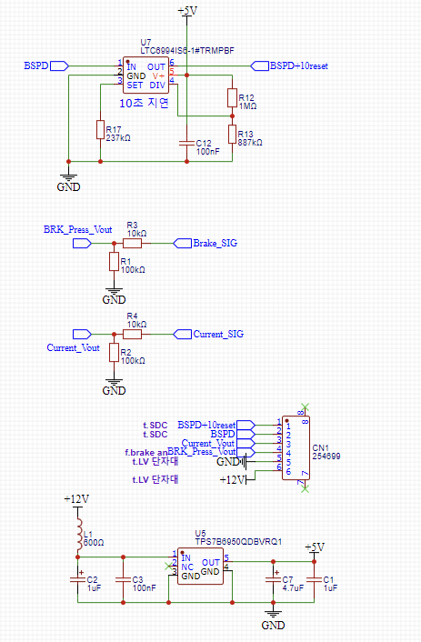

# LEF-26 BSPD 회로 해설

## 1. 비교기와 논리 극성

도면의 U1/U2/U4는 TLV1812-Q1, push-pull 출력이다. TLV182x의 오픈드레인과 혼동하지 않는다. 외부 기준전압을 비교하며, 출력 두 개를 직접 연결하지 않고 논리 게이트를 사용한다.

| 블록 | 기준 | LOW 조건 |
|---|---|---|
| U1.1 전류 | 약 2.58V | 신호가 기준 초과 |
| U1.2 브레이크 | 약 2.74V | 신호가 기준 초과 |
| U2.1/U2.2 상한 | 약 4.85V | 각 센서 신호가 상한 초과 |
| U4.1/U4.2 하한 | 약 0.24V | 각 센서 신호가 하한 미만 |

U9 OR 출력은 두 U1 출력이 모두 LOW일 때만 LOW다. 즉 물리적으로는 두 위험 조건의 동시 발생을 판단한다. 논리 게이트 이름과 물리 조건을 혼동하지 않는다.

## 2. 0.5초 지연 IC

U8 LTC6994-1은 R16 95.3kΩ으로 시간 기준을, R14 681kΩ/R18 1MΩ으로 분주·지연 방향을 정한다. 여기서는 LOW로 내려가는 전이를 지연한다. 위험 입력이 설정 시간 이전에 해제되면 지연된 Fault가 완성되지 않는다.

C11 100nF는 V+와 GND 사이 전원 디커플링이다. 25EVO의 C8 10µF처럼 임계값까지 충전되어 지연시간을 직접 정하는 소자가 아니다. 전용 타이머도 RSET 공차·IC 오차·전원 및 온도 조건을 검토해야 한다.

## 3. 센서 이상 경로

네 범위 비교기 출력은 U3 SN74HC08의 AND 결합으로 전달된다. 지연 결과까지 다섯 조건이 모두 HIGH여야 BSPD가 HIGH다. 센서 이상은 U8의 0.5초 지연 경로를 우회하여 최종 판단에 들어간다.

0.24V는 5V를 200kΩ/10kΩ으로 분압한 명목값 0.238V와 일치한다. 이것은 값이 만들어지는 방식의 계산이며, 그 저항비를 고른 설계 의도를 입증하지 않는다. 노션에서 정확한 선정 근거는 확인되지 않았다.

## 4. 10초 복귀·입력·전원

U7 LTC6994-1은 BSPD가 정상 HIGH로 돌아온 후 연속 정상 시간을 확인하여 BSPD+10reset을 SDC 쪽으로 보낸다. R17 237kΩ, R12 1MΩ/R13 887kΩ은 10초 지연 설정 부분이다. 명목 시간만으로 최소 10초 충족을 보장하지 말고 저항과 IC 오차를 포함해 검증한다.

브레이크·전류 입력 앞의 10kΩ/100kΩ 분압은 외부 센서 전압을 약 100/110배로 낮춘다. 도면에 적힌 내부 판정 전압과 외부 커넥터에서 측정한 전압을 구분한다.

U5 TPS7B6950-Q1은 12V에서 5V 전원을 만드는 레귤레이터다. 전원 커패시터는 입출력 안정화와 순간 부하 대응을 담당한다.

## 5. 래치의 위치에 대한 정정

26 BSPD 보드에 있는 것은 10초 복귀 신호 생성이다. 노션 SDC 설명은 그 신호를 받은 SDC 릴레이 자기유지 경로가 차단 상태 유지·재허가를 담당한다고 설명한다. 따라서 '26의 모든 래치가 BSPD PCB 안에 있다'고 일괄 표현하지 않는다. 25EVO 역시 SDC 리비전별 상태 유지 소자가 다를 수 있다.

## 6. 출처 및 다음 확인

[자료 출처](../docs/sources-and-notes.md)의 최신 노션 설명과 TI/ADI 소자 문서를 기준으로 작성했다. 실물 BOM, 보드 리비전, 초기 전원 상태, Fault 표시등, 단선 시 신호 전압은 실측으로 확인할 항목이다.
