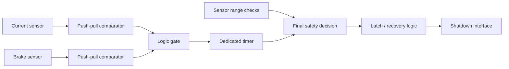

# LEF-26 BSPD Walkthrough

## Architecture



---

## 1. Comparator outputs

The newer implementation uses push-pull comparator outputs.

Unlike open-collector outputs, both HIGH and LOW are actively driven.

Therefore the comparator outputs are combined by an explicit logic gate instead of being directly wired together.

---

## 2. Condition combination

The logic gate converts the two threshold decisions into one persistence-timer input.

This makes two functions visually distinct:

- **Does the unsafe combination exist?**
- **Has it existed long enough?**

That separation is useful during debugging and verification.

---

## 3. Dedicated timing

A dedicated timer IC performs the persistence check.

Instead of waiting for a large capacitor to reach a comparator threshold, the delay is configured by the timer network.

This changes the verification problem.

For the timer implementation, check:

- configuration resistance
- divider / mode configuration
- input polarity
- output polarity
- power-up state
- actual measured timing boundary

A nominal calculated delay is not the same as a measured production value.

---

## 4. Sensor open/short detection

Upper/lower sensor-window comparators feed a separate safety path.

Conceptually:

```text
sensor within valid electrical window → allow validity condition
sensor outside window                → fault request
```

The range fault path should be traced independently from the normal 0.5 s plausibility timer.

---

## 5. Latch and reactivation

The design material also includes state-retention / recovery logic.

Two time concepts must remain separate:

- persistence before **fault activation**
- continuous safe time before **reactivation**

This distinction prevents the common mistake of treating every timer in a safety circuit as the same “delay.”

---

## 6. What I would measure

1. each comparator threshold
2. logic-gate truth table at real voltage levels
3. timer delay over supply/temperature
4. short-pulse rejection
5. sensor-invalid response time
6. latch set/reset behavior
7. continuous-safe-time reactivation boundary
8. output behavior during power loss
