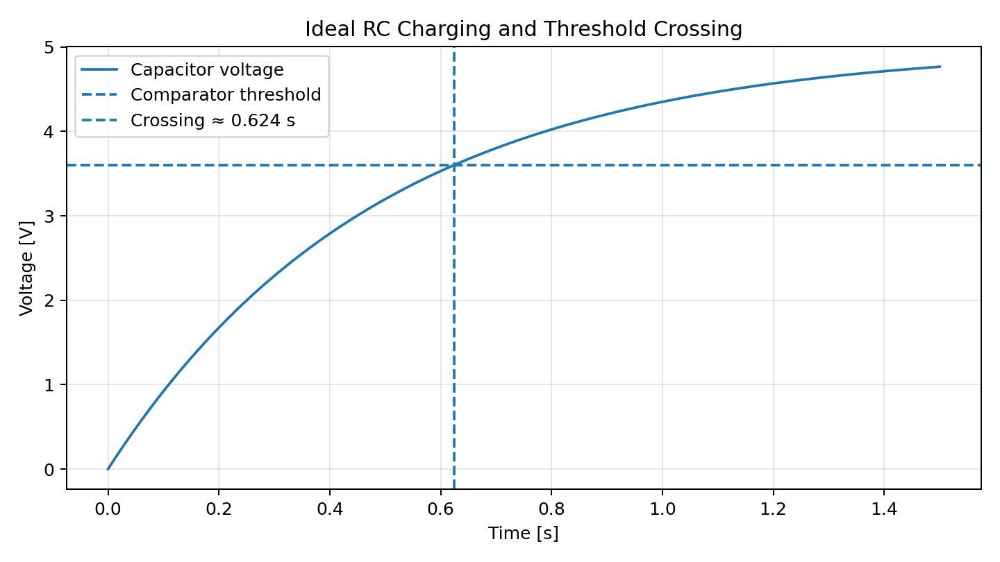
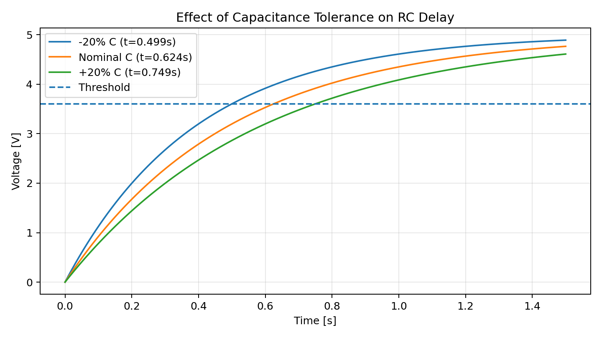

# RC Delay Simulation

This mini-project checks the analog timing intuition used in the 25EVO BSPD study.

## Model

Ideal capacitor charging:

`V(t) = VFINAL × (1 - exp(-t/RC))`

Nominal parameters used:

- `R = 49 kΩ`
- `C = 10 µF`
- `VFINAL = 5 V`
- `VTH = 3.6 V`

---

## Questions

1. Is the switching delay equal to the RC time constant?
2. How much does capacitor tolerance move the threshold-crossing time?
3. Why does a low-resistance diode discharge path help with repeated pulses?

---

## Nominal result

`τ = RC ≈ 0.49 s`

But the ideal threshold crossing is:

`tTH = -RC ln(1 - VTH/VFINAL) ≈ 0.624 s`

So “RC = 0.49 s” does **not** mean that the comparator switches at 0.49 s.



---

## Simple capacitance sensitivity

Using the same ideal model:

| Capacitance | Threshold crossing |
|---|---:|
| -20% | ~0.499 s |
| nominal | ~0.624 s |
| +20% | ~0.749 s |



This is not a full tolerance analysis; it illustrates why an analog timing stage should be verified with actual component values and measurement.

---

## Reproduce

Run:

```bash
python -m pip install -r requirements.txt
python simulate_rc_delay.py
```

The script uses NumPy and Matplotlib and can generate higher-resolution raster plots locally.

---

## Limitations

The model does not include:

- comparator hysteresis
- capacitor ESR / leakage
- diode forward-voltage variation
- exact source/output impedance
- temperature
- PCB leakage/parasitics

It is a first-principles verification, not a substitute for measurement or SPICE analysis.


## Resistance plus capacitance corners

Using R ±1% and C ±20% with fixed voltage/threshold gives approximately 0.494–0.756s. This is an ideal corner calculation, not a compliance claim. MLCC DC bias and threshold shifts are omitted.

The numerical script models isolated charging and capacitor tolerance; repeated-pulse diode behavior is provided separately in the [Falstad model](../falstad/README.md).
